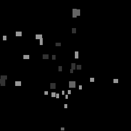
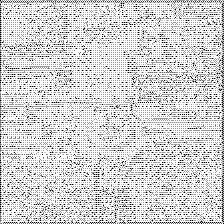
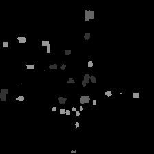

stanford-drone-semantic-segmentation
==============================

Solving semantic segmentation task for Stanford Drone Dataset

## Solution Brief:

1. To train the semantic segmentation mask prediction, bounding boxes are used as are.

2. Loss is *cross-entropy*.

3. Metric is *mean IoU*.

4. Transfer learning for encoder in *U-Net*, freeze encoder and train only decoder.

5. Augmentation (random flip left-right and random shift).

## Examples:

For some frame, the true mask looks like the figure below.

The figure below shows the predicted mask for this frame using MobileNet U-Net model before training.

And after training on the small data, the predicted mask looks like

## TODO:

- hyperparameter optimization

- loss function from [TernausNet](https://arxiv.org/pdf/1801.05746.pdf)

- bounding box as a bad semantic segmentation, improving it using self-training [[1](https://arxiv.org/pdf/2006.06882.pdf), [2](https://arxiv.org/pdf/1810.07911.pdf), [3](https://arxiv.org/pdf/2104.11692.pdf), [4](https://arxiv.org/pdf/2007.09886v2.pdf)]

- improving semantic segmentation using [video prediction](https://medium.com/visionwizard/video-semantic-segmentation-a-novel-approach-from-nvidia-8e3a89aa7aff)

- manually create true semantic segmentation masks for a part of data and train a neural network, using [semi-supervised learning](https://arxiv.org/pdf/2106.01226v2.pdf) or [semi-supervised learning + GAN](https://openreview.net/pdf?id=SJQO7UJCW)